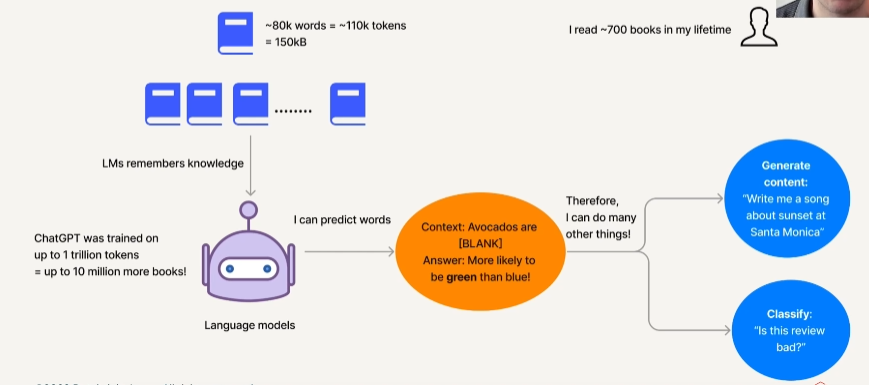
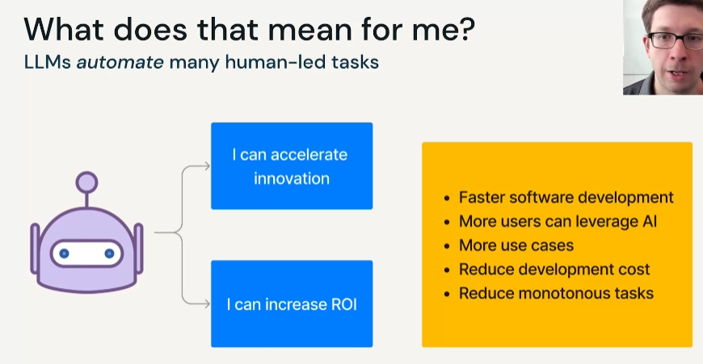
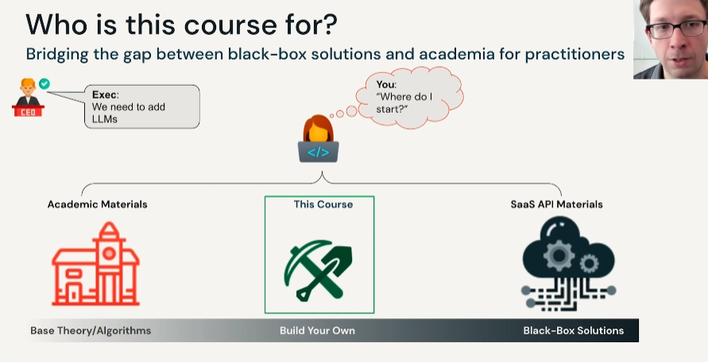

# 0.2 Why LLM?

## Real worlds Examples
- Chegg → disturb by chatgpt
- YouChat → use LLM as SaaS
- Github copilot → use LLM as SaaS

## LLMs are not that new
Why should we care now?
- accuracy and effectiveness has hit a tipping point (same as human level or beyond)
- large datasets
- GPUs
- open-sourced model

## What is an LLM?
- large model parameters
- train on large data
- try to predict words in text
	- mask some words and lets model predict by input other words on that sentence called `BERT`

## There is no `perfect` model
Trade-offs are required
start with these factors:
- model quality
- serving cost
	- how much you have to run per days
- serving latency
	- offline vs online
- customizability
	- monitoring
	- improving

## Pros (this course)
