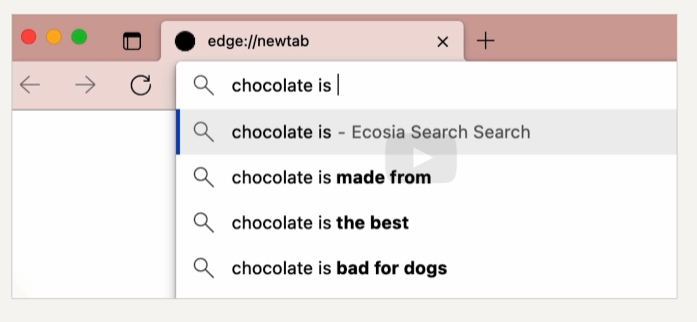
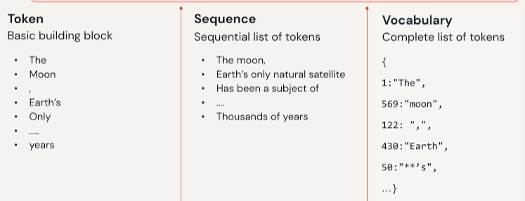
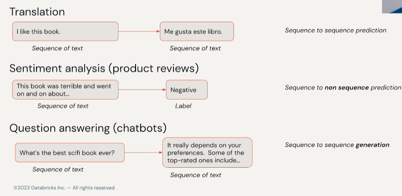
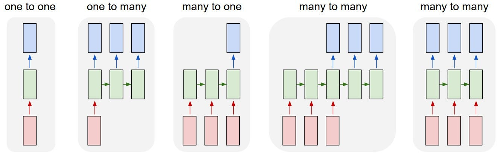

## We use NLP everyday

- e.g. auto complete but not LLMs (in the future maybe)

## Other use cases in NLP
- Semantic similarity 
	- Literature search.
	- Database querying. 
	- Question-Answer matching 
- Summarization
	- Clinical decision support.
	- News article sentiments. 
	- Legal proceeding summary.
- Text classification
	- Customer review sentiments.
	- Genre/topic classification.

## NLP Basic Glossary
- token
- sequence → list of tokens
- vocabulary → complete list of tokens

## Types of sequence tasks

## Multimodal with NLP (goes beyond texts)
- image captioning (img2text)
- diffusion (text2img)
- speech recognition