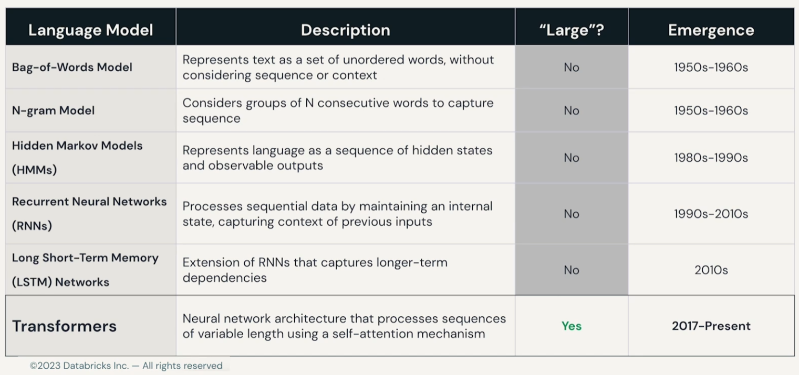
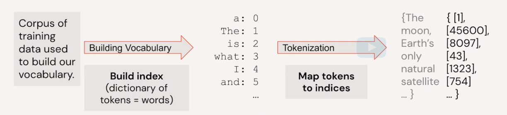
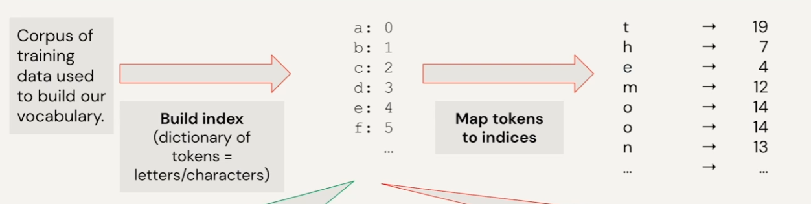
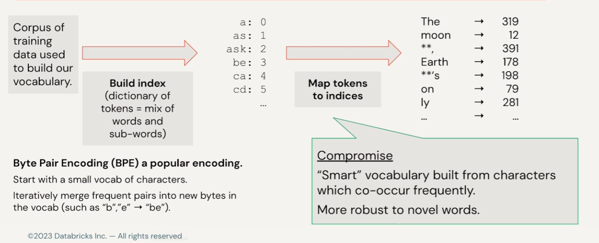
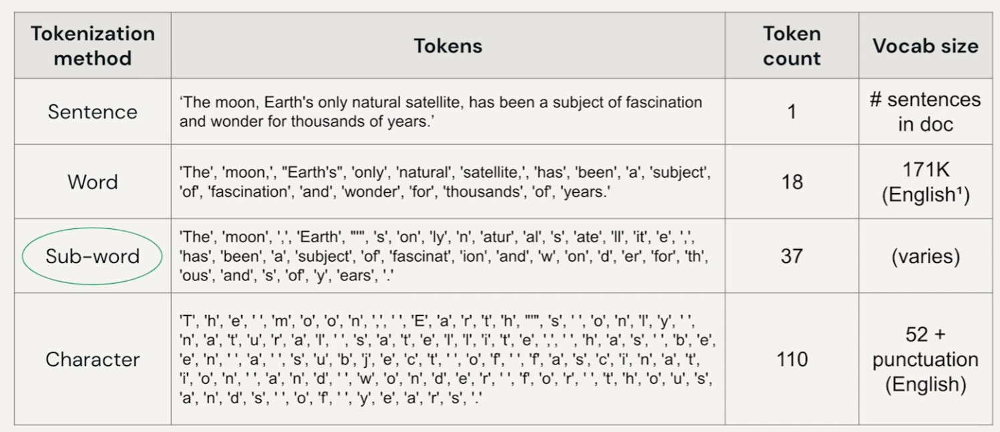
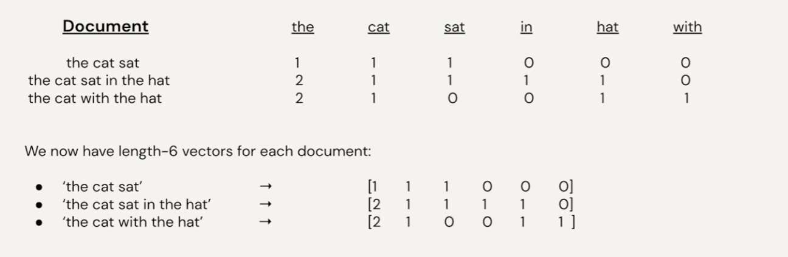
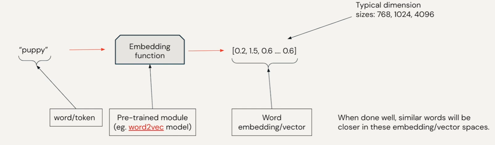
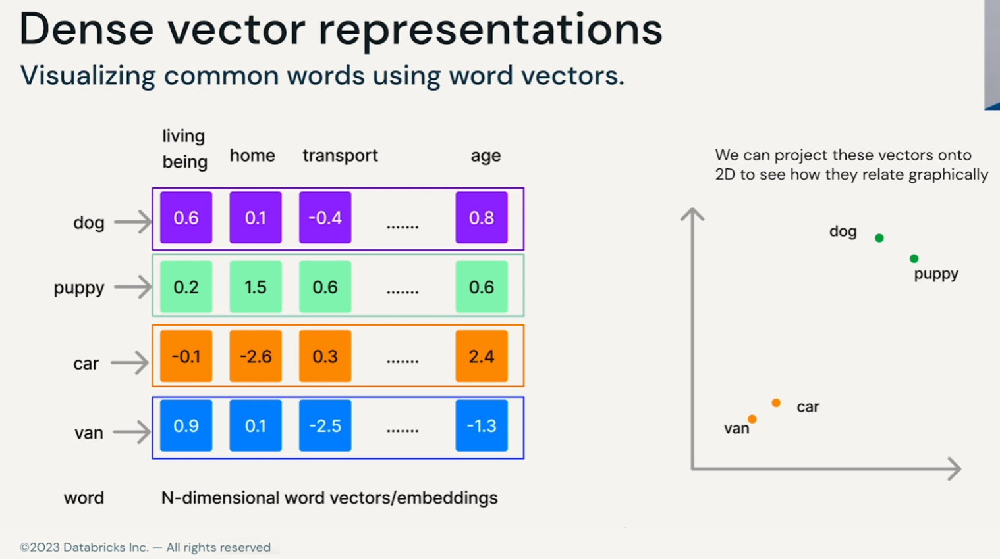

## We use NLP everyday

- e.g. auto complete but not LLMs (in the future maybe)

## Other use cases in NLP
- Semantic similarity 
	- Literature search.
	- Database querying. 
	- Question-Answer matching 
- Summarization
	- Clinical decision support.
	- News article sentiments. 
	- Legal proceeding summary.
- Text classification
	- Customer review sentiments.
	- Genre/topic classification.

## NLP Basic Glossary
- token
- sequence → list of tokens
- vocabulary → complete list of tokens (dictionary pairs)

## Types of sequence tasks

## Multimodal with NLP (goes beyond texts)
- image captioning (img2text)
- diffusion (text2img)
- speech recognition

## What is a Language Model?
input sequence and then predict most likely word in openai called `Foundation Model`
2 Types of Language Model
1. Generative ==to find most likely== next word
2. Classification ==to find most likely== classification/answer

## What is a ==Large== Language Model?

## Tokenization
### Words base

cons:
- can get error of OOV (out of vocabs) if your vocabulary didn’t large enough
- misspelling also get OOV

### Characters base

pros:
- small vocabulary solve OOV issues
cons:
- loss of context within words
- seq lenght become very long

### Sub-words

pros:
- solve above both two cons

## Word Embeddings
- turn tokenize (words) to vectors called `word2vec`
- the ideas is in the same vector space the word which have near meaning will have vectors near together in the space dimension also

### First Ideas of word embeddings TF-IDF method #❓

cons:
- sparsity matrix become large of zero

### word2vec

note that we are not actually know each columns meaning but it is the concept how its work!

