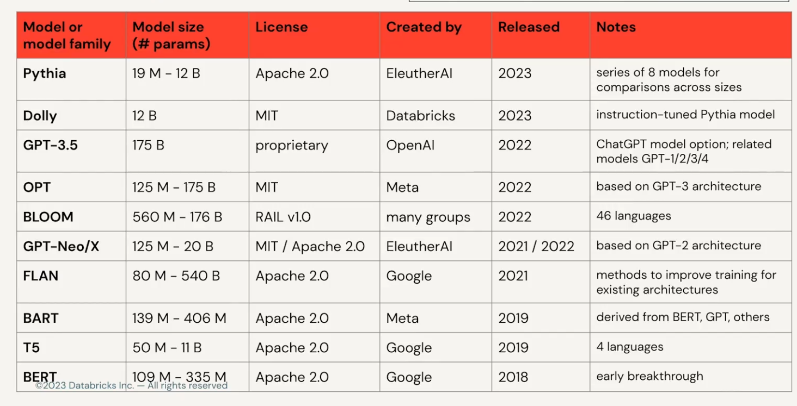

1. filter by task
2. model size 
	1. easy way is to look at `pytorch_model.bin` file size instead
3. last update by check git release history
4. some detail e.g. name of model ex `t5`, datasets that model use to trained

## common use

