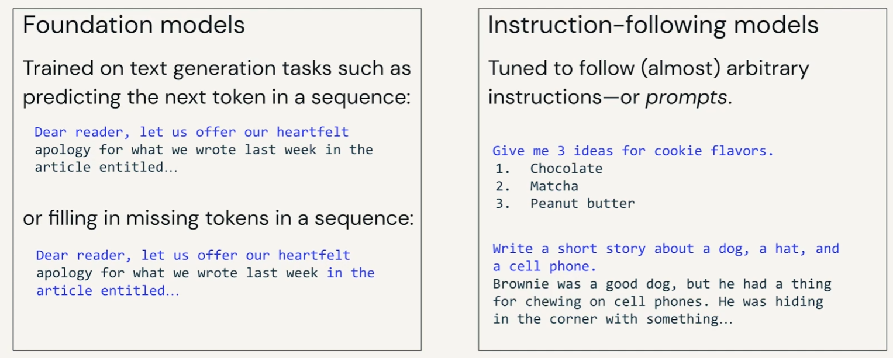

## Common tasks

## Sentiment Analysis (many to one)

- Classification

## Translation (many to many)

## Zero-shot classification
- didn’t have to fine tune model
- can use pretrained model with unseen datasets

## Few-shot Learning
- learn on the fly
- by example chain of thought when passing the prompt

