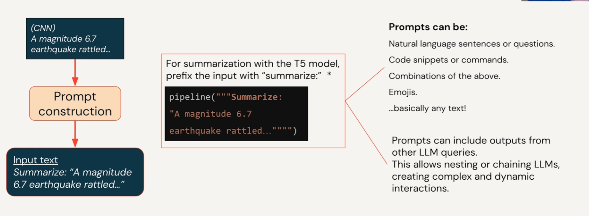
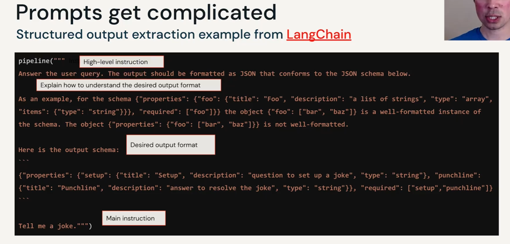

## Instruction-following LLMs

- Foundation models are like BERT, GPT which train to predict next word or predict masked words on general data → objective is to understand the languages
- Instruction-following models are the model which fine tune Foundation model with Instruction data → objective is to make model smarter with guide by new data (also predict the next words)

so the blue line on the right box is also called `prompt` when we have inference to make model know the same environment as training period

and then after training with large datasets the model know and understand your prompt (think like when you use ChatGPT) beyond instruction prompt
