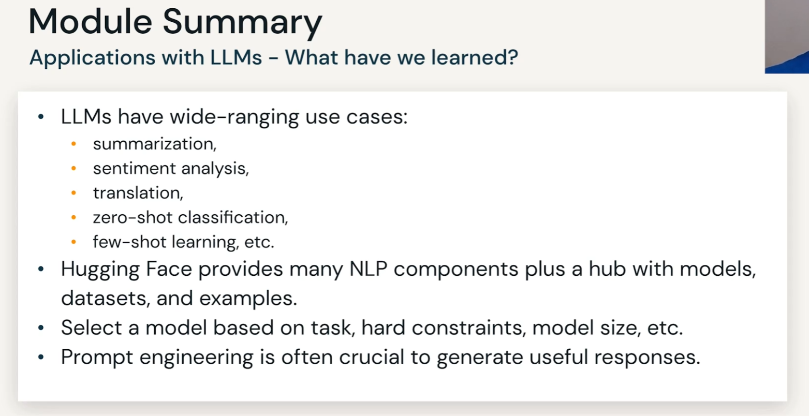

note that different model and the same prompt will get different results
this prompt maybe work good on ChatGPT but can be not good with Non-ChatGPT model

## Some prompt make model to reach a better answer

## Prompt formatting tips

## Prompt hacking

### how to prevent

