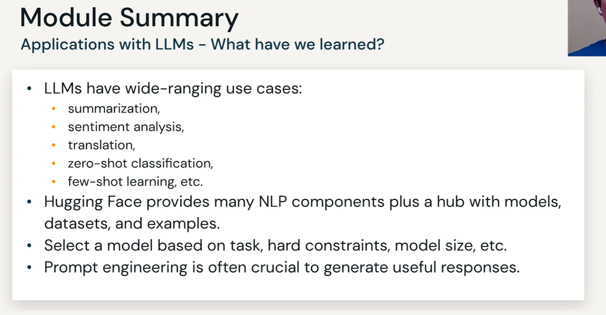

## Module 0: Course Introduction
- [0.2 Why LLM](0.2%20Why%20LLM.md)
- [0.3 Primer on NLP](0.3%20Introduction%20to%20NLP.md)
## Module 1: Applications with LLMs

- [1.1 Introduction](1.1%20Introduction.md)
- [1.2 Hugging Face](1.2%20Hugging%20Face.md)
- [1.3 Model Selection](1.3%20Model%20Selection.md)
- [1.4 NLP Tasks](1.4%20NLP%20Tasks.md)
- [1.5 Prompts](1.5%20Prompts.md)
- [1.6 Prompt Engineering](1.6%20Prompt%20Engineering.md)

